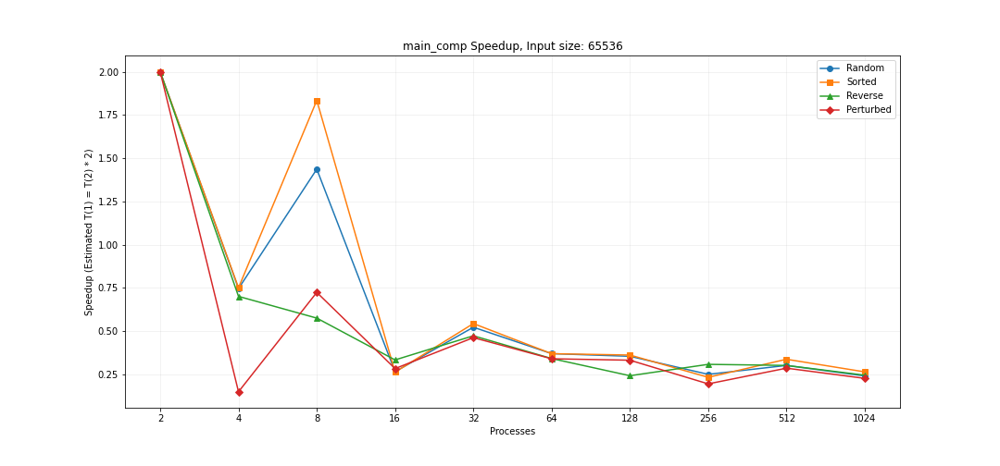

# CSCE 435 Group project

## 0. Group number: 
14
## 1. Group members:
1. Gavin Bardwell
2. Tyson Long
3. Andrew Pribadi
4. Darwin White

## 2. Project topic
We will implement and analyze the effectiveness of four parallel sorting algorithms. In our project we will implement bitonic, sample, merge, and radix sorts. We will compare overall sorting times between processes, efficiency with limited number of cores, and compare and contrast various edge cases to find maximum and minimum times for all sorting algorithms. 
For primary communication we will utilize a text message group chat.    
### 2a. Brief project description (what algorithms will you be comparing and on what architectures)

- Bitonic Sort: Bitonic sort is a recursive sorting algorithm which sorts bitonic sequences by comparing and swapping sections of the of the array in a predefined order. A bitonic sequence is a sequence that is strictly increasing, then decreasing. At each stage of the sort a portion
of the sequence is swapped and then remerged into a larger portion of the sequence. Only arrays of size 2^n can be sorted.
- Sample Sort: Sample sort is a divide-and-conquer algorithm similar to how quicksort partitions its input into two parts at each step revolved around a singluar pivot value, but what makes sample sort unique is that it chooses a large amount of pivot values and partitions the rest of the elements on these pivots and sorts all these partitions.
- Merge Sort: Merge sort is a divide-and-conquer algorithm that sorts an array by splitting the array into halves until each sub-array contains a single element. Each sub-array is then put back together in a sorted order.
- : ing is a non-comparative sorting algorithm where numbers are placed into buckets based on singular digits going from least significant to most significant.

### 2b. Pseudocode for each parallel algorithm

- For MPI programs, include MPI calls you will use to coordinate between processes

# Pseudocode for MPI Parallel Bitonic Sort
- Bitonic Sort Pseudocode
- Inputs is your global array

1. Seed the array in the parent process
2. Scatter the values to the processes
3. Sort each process into a bitonic sequence
4. Send values between each partner process
5. Keep swapping until we reach a sorted array
6. Gather all the process values back into the master
7. Check for correctness and finalize

```
//Bitonic Merge
bitonicMerge(data, low, count, direction) {
    if (count > 1)
        int k = count / 2;
        for (int i = low; i < low + k; ++i)
            if ((data[i] > data[i + k]) == direction)
                std::swap(data[i], data[i + k]);
        bitonicMerge(data, low, k, direction);
        bitonicMerge(data, low + k, k, direction);
}

//Bitonic Sort (sequential on local data)
bitonicSort(data, low, count, direction) {
    if (count > 1)
        int k = count / 2;
        bitonicSort(data, low, k, true);  // Sort in ascending order
        bitonicSort(data, low + k, k, false);  // Sort in descending order
        bitonicMerge(data, low, count, direction);
}

main() {
    //Initialize array and MPI
    MPI_Init();

    //Getting the total processes and rank
    int size, rank;
    MPI_Comm_size(MPI_COMM_WORLD, &size);
    MPI_Comm_rank(MPI_COMM_WORLD, &rank);

    //Initializing the array to be sorted
    if (rank == 0)
        arr = random array;
    subarray(2^n / size);
    int localSize = 2^n / size;

    //Scatter the data from root to all processes
    MPI_Scatter(arr, localSize, MPI_INT, arr, subarray, MPI_INT, 0, MPI_COMM_WORLD);

    //Sort the local data using bitonic sort
    bitonicSort(subarray, 0, localSize, true);

    //Perform parallel bitonic sorting
    for (int phase = 1; phase <= size; ++phase)
        int partner = rank ^ (1 << (phase - 1));  //Find partner using bitwise XOR

        //Exchange data with partner process
        dataReceived(localSize);
        MPI_Sendrecv(subarray, localSize, MPI_INT, partner, 0,
                     dataReceived, localSize, MPI_INT, partner, 0,
                     MPI_COMM_WORLD, MPI_STATUS_IGNORE);

        //Merge received data with local data
        if (rank < partner)
            // Ascending order
            subarray.insert(subarray.end(), dataReceived.begin(), dataReceived.end());
            bitonicMerge(subarray, 0, subarray.size(), true);
            subarray.resize(localSize);  // Keep only first half
        else
            //Descending order
            subarray.insert(subarray.end(), dataReceived.begin(), dataReceived.end());
            bitonicMerge(subarray, 0, subarray.size(), false);
            subarray.resize(localSize);  // Keep only second half

    //Gather the sorted subarrays at root process
    MPI_Gather(subarray, localSize, MPI_INT, arr, localSize, MPI_INT, 0, MPI_COMM_WORLD);

    MPI_Finalize();
    return 0;
}
```
# Pseudocode for MPI Parallel Sample Sort
- Sample Sort Pseudocode 
- Inputs is your global array
1. Initialize MPI
2. Sample n * k elements from the unsorted array
3. Share these samples with every processor
4. Sort the samples and select k-th, 2*k-th, 3*k-th...n*k-th as pivots
5. Split the data into buckets according to pivots
6. Send each bucket to their respective processor
7. Sort each bucket in parallel
8. Gather all the sorted buckets merging at the root processor
9. Finalize MPI

```
main () {
    // Initialization 
    arr = input array 
    MPI_Init(); 

    int num_proc, rank; 
    MPI_COMM_RANK(MPI_COMM_WORLD, &rank) 
    MPI_COMM_SIZE(MPI_COMM_WORLD, &num_proc) size = arr / num_proc 

    // Distribute data 
    if (rank == 0) { 
        localArr = arr with 'size' amount of elements MPI_Scatter(arr, size, localArr) 
    } 

    // Local Sort on each Processor 
    sampleSort(localArr[rank])

    // Sampling 
    sample_size = num_proc - 1 samples = select_samples(localArr[rank], sample_size)

    // Gather samples on root 
    MPI_Gather(localArr, size, sortedArr) 
    if (rank == 0) { 
        sorted_samples = SampleSort(sortedArr) 
        pivots = Choose_Pivots(sorted_samples, num_proc - 1) 
    }

    // Broadcast MPI_Bcast(&pivots, size, MPI_INT, root, MPI_COMM_WORLD);

    // Redistribute data according to pivots 
    send_counts, recv_counts, send_displacements, recv_displacements = arr size num_proc 
    for(int i = 0; i < size; i++) { 
        for(int j = 0; j < num_proc; j++) { 
            if(localArr[rank][i] <= pivots[j]) 
                send_data_to_processor(j) 
        } 
    }

    // Perform All-to-All communication 
    MPI_Alltoall(send_counts, send_displacements, recv_counts, recv_displacements)

    // Local sort again after redistribution 
    sampleSort(localArr[rank])

    // Gather sorted subarrays 
    MPI_Gather(localArr[rank], size, gatherSortedArr)

    // Final merge at root processor 
    if (rank == 0) 
        sampleSort(gatherSortedArr)

    // Finalize MPI 
    MPI_Finalize();
}
```

# Pseudocode for MPI Parallel Merge Sort
- Merge Sort Pseudocode
- Inputs is your global array
1. Initialize MPI
2. Divide the array evenly among processes
3. Perform sequential merge sort on subarray on each process
4. Gather subarrays at the root process
5. Perform merge sort on combined array
6. Finalize MPI

```
main() {
    // Initialize an unsorted array (arr)
    arr = unsorted array;

    // Variables to track rank and number of processes
    int world_rank;
    int world_size;

    // Initialize MPI
    MPI_INIT();

    // Get current process rank
    MPI_COMM_RANK(MPI_COMM_WORLD, &world_rank);

    // Get total number of processes
    MPI_COMM_SIZE(MPI_COMM_WORLD, &world_size);

    // Divide array into equal-sized chunks
    int size = size_of_array / world_size;

    // Allocate space for each process's sub-array (subArr)
    subArr = allocate array of size 'size'

    // Scatter the array across processes
    MPI_Scatter(arr, size, subArr);

    // Each process performs mergeSort on its sub-array
    mergeSort(subArr);

    // Gather the sorted sub-arrays at root process (world_rank == 0)
    MPI_Gather(subArr, size, sorted_arr);

    // Root process merges the sorted sub-arrays into a final sorted array
    if(world_rank == 0) {
        mergeSort(sorted_arr);
    }

    // Finalize MPI
    MPI_Finalize();
}

mergeSort(arr) {
    // Base case: If array has only one element, it is already sorted
    if left < right {
        // Find the midpoint of the array
        mid = (left + right) / 2;

        // Recursively sort the left half of the array
        mergeSort(left half of arr);

        // Recursively sort the right half of the array
        mergeSort(right half of arr);

        // Merge the two sorted halves
        merge(arr, left, mid, right);
    }
}

merge(arr, left, mid, right) {
    // Allocate a temporary array to store the merged result
    tempArr = temporary array of size (right - left + 1)

    // Initialize pointers for the left and right halves
    left_pointer = left;
    right_pointer = mid + 1;
    temp_pointer = left;

    // While both halves have elements
    while left_pointer <= mid AND right_pointer <= right {
        if arr[left_pointer] <= arr[right_pointer] {
            // Add the smaller element from the left half to tempArr
            tempArr[temp_pointer] = arr[left_pointer];
            left_pointer++;
        } else {
            // Add the smaller element from the right half to tempArr
            tempArr[temp_pointer] = arr[right_pointer];
            right_pointer++;
        }
        temp_pointer++;
    }

    // Copy any remaining elements from the left half
    while left_pointer <= mid {
        tempArr[temp_pointer] = arr[left_pointer];
        left_pointer++;
        temp_pointer++;
    }

    // Copy any remaining elements from the right half
    while right_pointer <= right {
        tempArr[temp_pointer] = arr[right_pointer];
        right_pointer++;
        temp_pointer++;
    }

    // Copy the merged elements from tempArr back to arr
    for i = left to right {
        arr[i] = tempArr[i];
    }
}
```


# Pseudocode for MPI Parallel 
-  Pseudocode
- Inputs is your global array size, number of processes, and type of sorting
the algorithm goes as such
1. Generate your data in each thread
- this is then sent to the master where it writes it to "unSortedArray.csv"
2. perform 
- seperate each thread into buckets of bits 1s and 0s
- send the 0s to the top and 1s after that
- repeat with the next bit
- send to the master thread
3. Verify that the  worked
- this is done in the master thread
4. write the sorted data to "sortedArray.csv"
## Main Function
```
main() {
    // Initialize MPI environment
    MPI_Init();

    // Variables to track rank and number of processes
    int task_id;
    int num_procs;

    // Get current process rank
    MPI_Comm_rank(MPI_COMM_WORLD, &task_id);

    // Get total number of processes
    MPI_Comm_size(MPI_COMM_WORLD, &num_procs);

    // If task is master
    if (task_id == MASTER) {
        // Distribute data among workers
        for each worker (i from 1 to num_procs - 1) {
            // Calculate data chunk size and send data
            MPI_Send(data_chunk, size, MPI_INT, i, 0, MPI_COMM_WORLD);
        }

        // Receive unsorted data from workers and write to file
        for each worker (i from 1 to num_procs - 1) {
            MPI_Recv(unsorted_data, size, MPI_INT, i, 1, MPI_COMM_WORLD, &status);
            writeDataToFile("unsortedArray.csv", unsorted_data);
        }

        // Receive sorted data from workers and write to file
        for each worker (i from 1 to num_procs - 1) {
            MPI_Recv(sorted_data, size, MPI_INT, i, 2, MPI_COMM_WORLD, &status);
            writeDataToFile("sortedArray.csv", sorted_data);
        }

        // Check if sorted correctly
        checkSorted(sorted_data);
    }
    else {
        // Receive data from master
        MPI_Recv(local_data, size, MPI_INT, MASTER, 0, MPI_COMM_WORLD, &status);

        // Perform  on local data
        parallel_radix_sort(local_data, max_bits, MPI_COMM_WORLD);

        // Send unsorted data to master
        MPI_Send(local_data, size, MPI_INT, MASTER, 1, MPI_COMM_WORLD);

        // Send sorted data to master
        MPI_Send(local_data, size, MPI_INT, MASTER, 2, MPI_COMM_WORLD);
    }

    // Finalize MPI environment
    MPI_Finalize();
}
```

##  Function
```
parallel_radix_sort(local_data, max_bits, comm) {
    // Iterate over each bit from least significant to most significant
    for bit from 0 to max_bits - 1 {
        // Split data into zero and one buckets based on current bit
        zero_bucket = elements with bit 0;
        one_bucket = elements with bit 1;

        // Gather sizes of zero buckets from all processes
        MPI_Allgather(size of zero_bucket, global_zero_sizes);

        // Calculate displacements for gathering zero bucket data
        calculate_displacements(global_zero_sizes, zero_recv_displs);

        // Gather all zero bucket data from processes
        MPI_Allgatherv(zero_bucket, global_zero_sizes, zero_recv_displs, zero_recv_buffer);

        // Gather sizes of one buckets from all processes
        MPI_Allgather(size of one_bucket, global_one_sizes);

        // Calculate displacements for gathering one bucket data
        calculate_displacements(global_one_sizes, one_recv_displs);

        // Gather all one bucket data from processes
        MPI_Allgatherv(one_bucket, global_one_sizes, one_recv_displs, one_recv_buffer);

        // Merge zero and one buckets to update local data
        local_data = zero_recv_buffer + one_recv_buffer;

        // Synchronize all processes before moving to next bit
        MPI_Barrier(comm);
    }
}
```

##  Helper Functions
### `checkSorted(data)`
```
checkSorted(data) {
    // Iterate through data to verify sorting
    for i from 1 to size of data - 1 {
        if data[i] < data[i - 1] {
            print "Array is NOT sorted correctly.";
            return;
        }
    }
    print "Array is sorted correctly.";
}
```
### `writeDataToFile(filename, data)`
```
writeDataToFile(filename, data) {
    // Open file in write mode
    open file with name filename;
    
    // Write each element of data to file
    for element in data {
        write element to file;
    }
    
    // Close the file
    close file;
}
```


### 2c. Evaluation plan - what and how will you measure and compare
We will be working through arrays of sizes 2^16, 2^18, 2^20, 2^22, 2^24, 2^26, 2^28. We will test the sorting speed of presorted, randomly sorted, reverse sorted, and 1% perturbed. 

We will also test the all of these with increasing processors in range 2, 4, 8 ,16, 32, 64, 128, 256, 512, and 1024. At the end we will have run 280 sorts one for each array size with each array type and each processor count. This will allow us to analyze and understand the advantages and disadvantages of all sorting algorithms tested.


### 3a. Caliper instrumentation

Bitonic Sort

```
1.507 main
├─ 0.000 MPI_Init
├─ 0.027 data_init_runtime
├─ 0.877 comm
│  ├─ 0.015 MPI_Scatter
│  └─ 0.862 comp
│     ├─ 0.823 comp_large
│     └─ 0.001 comm_small
│        └─ 0.001 MPI_Sendrecv
├─ 0.000 MPI_Finalize
├─ 0.015 ve@
├─ 0.000 MPI_Initialized
├─ 0.000 MPI_Finalized
└─ 0.008 MPI_Comm_dup
```
Sample Sort
```
65.972 main
├─ 0.000 MPI_Init
├─ 2.780 data_init_runtime
├─ 4.374 comm
│  ├─ 2.782 MPI_Bcast
│  ├─ 0.378 comm_small
│  │  └─ 0.378 MPI_Scatter
│  ├─ 0.634 MPI_Gather
│  └─ 0.580 MPI_Alltoall
├─ 53.208 comp
├─ 0.000 MPI_Bcast
├─ 0.704 correctness_check
├─ 0.000 MPI_Finalize
├─ 0.000 MPI_Initialized
├─ 0.000 MPI_Finalized
└─ 1.667 MPI_Comm_dup

```

Merge Sort

```
96.017 main
├─ 0.000 MPI_Init
├─ 5.792 data_init_runtime
├─ 24.045 comm
│  ├─ 0.808 comm_large
│  │  ├─ 0.437 MPI_Scatter
│  │  └─ 0.371 MPI_Gather
│  └─ 23.237 MPI_Barrier
├─ 42.682 comp
│  └─ 42.682 comp_large
├─ 0.711 correctness_check
├─ 0.000 MPI_Finalize
├─ 0.000 MPI_Initialized
├─ 0.000 MPI_Finalized
└─ 0.000 MPI_Comm_dup
```

 
```
0.349 main_comp
├─ 0.000 MPI_Comm_free
├─ 0.002 MPI_Comm_split
├─ 0.181 comm
│  └─ 0.181 comm_large
│     ├─ 0.292 MPI_Recv
│     └─ 0.001 MPI_Send
├─ 0.159 comp
│  ├─ 0.318 comp_large
│  │  ├─ 0.001 MPI_Allgather
│  │  ├─ 0.003 MPI_Allgatherv
│  │  └─ 0.000 MPI_Barrier
│  └─ 0.000 comp_small
├─ 0.002 correctness_check
└─ 0.010 data_init_runtime
```
### 3b. Collect Metadata

We collect the following metadata for our implementations: the launch date of the job, the libraries used, the command line used to launch the job, the name of the cluster, the name of the algorithm you are using, the programming model, he datatype of input elements, the size of the datatype, the number of elements in input dataset, the input type of array, the number of processors, the scalability of our algorithms, the number of your group, and where we got the source code of our algorithm.

### **See the `Builds/` directory to find the correct Caliper configurations to get the performance metrics.** They will show up in the `Thicket.dataframe` when the Caliper file is read into Thicket.
## 4. Performance evaluation

**Bitonic Sort**


The communication graphs effectively show the power of parallelizing a bitnoic sort on more and more processors. As we increase the number
of processors, the communication time decreases. Although we are increasing the number of messages sent, we are decreasing the amount of
data sent between each message. This causes a noticeable amount of speedup as we add more processors. There is data missing here, but I don't
believe the runs failing was caused by the main communication portion of the algorithm. It's also worth mentioning that on the smaller input
sizes the communication overhead caused by more processors was enough to increase the overall communication time.


One thing to note about these graphs is that I had a smaller communication region nested within the computation portion of my algorithm. This
caused the smaller input sizes to actually increase in computation time as we added more processors similar to the starting communication graphs.
However, for all the other input sizes, the graph decreases in computation time as we add more processors.


These are the communication region inside of the large computation section. They stay fairly constant and are slightly increased by the
large input sizes due to more data being sent. Overall, they remain low though.


When looking at the main speedup, you'll notice that the speedup started by decreasing on the smaller input sizes and then begin slowly
increasing as the we started using larger and large input sizes. The decreasing on the smaller input sizes was definitely caused by
communication overhead caused by the larger number of processors. Eventually, the program time got so long that the speedup caused by having
more processors outweighed the communication overhead. Therefore, the speedup slowly began increasing with input size increases.


Communication experiences a very similar speedup as to the main program speedup. At the beginning, the overhead caused by more processors
slowed it down, but with higher input sizes, it bagan experiencing rapid speedup.


Once again, the large computation section experienced slow down on the smaller input sizes. This is likely due to communication overhead.
However, there was a significant amount of speedup as we added more processors to the large input sizes. Even though we are missing some data
in the biggest input sizes, I believe that the speedup would have either continued. There may have been a point at which it plateaued, but
the data I do have shows significant speedup up to the processor sizes the did run.


Finally, the nested communication region is the same pattern once again. No speedup on the smaller input sizes due to communication overhead,
then significant speedup on the higher input sizes.


For all 4 of the weak scaling plots, we see decreases in time across the board. Execution time starts high on the smaller number of processors,
but as we add more and more, the time gets lower and lower. One thing to notice is that there appears to be a certain point at which the 
execution time does not get any lower. For all of the graphs, that appears to be at 64 processors. This could be a limitation of my
algorithm implementation, or the bitonic sort itself. It's possible that with even higher input sizes, we still would have been able to
see decreases in execution time past 64 processors.

One thing you may have noticed throughout all the graphs was the missing data points on the higher input sizes. I was only able to
create 209 Caliper files from my algorithm, simply because a lot of the large input sizes did not finish running in reasonable amount of time.
I hardcapped every run of the algorithm at 30 minutes, so it's possible they would have finished with more time. I know this was most likely a
problem with my implementation. This could have been a problem with my large computation section although I find that unlikely. The one thing
I believe it to be was my correctness check at the end. After I finish computing the sort, I used an MPI_Gather to grab all the elements back
to the master to check the correctness of the array. I believe this is what caused so many of my runs to time out. Running a 2^28 array sequentially just takes too much time, and the communication overhead to do so may have caused issues.


**Sample Sort**
Note: All of the following Sample Sort graphs are limited to 64 processors as the cali files above 64 were not able to be processed by thicket correctly.


Observing these main strong scaling graphs, processing time seems to increase as the amount of processors increase up until 2^24, at which point the execution time is higher with less processors and decreases as the amount of processors increase. This is likely due to smaller input sizes result in wasted time through communication and synchronization overhead while larger input sizes utilize this time better. Overall, most of the graphs seem to taper off around 64 processors, indicating that adding more processors wouldn't make the algorithm any more efficient and it would be more efficient to look for ways to improve the algorithm itself rather than indefinitely scaling up the amount of processors.


For the comm strong scaling graphs, 2^16 is the only outlier with a very low time except for the reverse sorted arrays causing a huge spike which could just be nondeterministic. For each input size after that, they tend to look pretty similar with the graphs almost looking like a pyramid, and the perturbed arrays tend to have a large spike in time at 32 processors, and something to note is that starting from 2^22 and up input sizes, the random array types tend to have the highest time compared to the other array types. This indicates that non-uniform data access patterns increase communication costs greatly compared to other array types. Sorted and Reverse Sorted arrays tend to have the lowest communication overhead, suggesting better scalability for these array types.


For these comp large strong scaling graphs, 2^16 is again the only outlier however it makes sense as the lower input size could result in wasted/inefficient computation time as processor counts increase due to specific array types such as random, sorted, or perturbed. For all the input types larger than 2^16, the graphs are very consistent where as the amount of processors increase, the computation time decreases which aligns with the goal of parallelizing these algorithms of splitting up the workload would increase efficiency of the algorithm itself.


Looking at the main strong scaling speedup plots, speedup tends to almost always decline as processors increase from every input size lower than 2^26, which is likely due to communication and synchronization overhead. Despite this, 2^26 and 2^28 input types have a solid increase in speedup which show that larger input types benefit more from parallelization.


In the comm strong scaling speedup plots, speedup almost always decreases as the amount of processors increase which is correct as there is always a larger amount of communication overhead with the increase in processors. Some of these graphs spike back up at 64 processors, which I cannot exactly tell if it is nondeterministic or not, but this could be due to these specific array types being sorted could help in communication with larger processor counts, as the random array type in these plots does not spike up as much as the other array types.


For the comp large strong scaling speedup plots, speedup almost always increases as processor amount increases which is correct as the increase in processor amount reduces computational load and would increase efficiency in these computations. The only outlier to this would be the 2^16 input type which is understandable as the smaller input could just be too inefficient with too many processors as it would take more time communicating than actual computation.


For weak scaling main, the graph has a large drop in execution time from 2 to 4 processors, and afterwards remains very constant as processor count increases. This shows that the main doesn't have much issue in workload as processors increase.


For the weak scaling comm graph, the time seems to increase as the processor count increases which aligns with the idea of increased communication overhead as there are more processors that the implementation has to communicate with. This is highlighted in the fact that the random array type has the largest execution time due to the unorganized input compared to other input types.


For weak scaling comp large graph, the time drops tremendously from 2 to 4 processors and then stays low as processor count increases, showing the algorithm having to perform less work as processor counts increase due to the balanced workload. 

**Merge Sort**


For main strong scaling, there appears to be a general trend of increasing time as the number of processes increases until we get to an array size of 2^24. For input sizes of 2^24, 2^26, and 2^28, there appears to be a sudden spike in time at a random number of processes. It then levels out to what it was before. This appears to happen at random for some input types. This pattern is not consistent.

The pattern of increasing time as the number of processes increases is most likely due to increasing communication overhead. As the number of processes increases, more communication needs to happen between the processes. The patter of random spikes in time at random places for different input types is most likely due to congestion as the many processes compete for resources.


For comm strong scaling, there appears to be a random spikes in time at random places for all different input types. This is most likely due to congestion as the many processes compete for resources. These random spikes are likely nondeterministic.


For comp large strong scaling, there appears to be a trend of decreasing time as the number of processes increases. This is expected because as the number of processes increases, the workload is distributed across the many processes. Therefore, there is less work for each individual process to compute.


For main strong scaling speed up, sequential merge sort seems faster for smaller input sizes. This is likely due to communication overhead. At the end of merge sort in parallel, all of the processes send their individual subarrays back to the master process, then one final merge sort must be performed. The cost of the individual processes communicating with each other does not justify doing merge sort in parallel for smaller input sizes. Specifically, we start seeing an improvement from doing merge sort in parallel at an input size of 2^24, but it becomes very clear that there is an improvement from performing merge in parallel with an input size of 2^28.


For comm strong scaling speed up, a decreasing speed up graph is expected. This is because there is no communication overhead for a single process. There is no need for data transfer between multiple processes. However, as we increase the number of processes, this means more processes need to communicate with each other. Particularly for merge sort, each process is performing merge sort on a subarray of the original input. As all of these subarrays get sent back to the master process to perform one final merge sort, a lot of communication overhead takes place. This is what results in the decreasing graphs for comm strong scaling speed up.


For comp large strong scaling speed up, all of the graphs are increasing for each input size. This is because the work is divided evenly among the many processes. For a single process, the computation time depends mostly on the input size. If the work is divided among more processes, the work load for each individual process is less. This decreases the overall computation time for each process since each process is working with a smaller subarray. This is what results in the increasing graph as the number of processes increases.


For main weak scaling, the graph appears to be relatively constant. This suggests that merge sort scales well with an increasing workload. Each process handles its portion of the workload without significant overhead.


For comm weak scaling, the increasing graph as the number of processes increases and the input size increases suggests that the communication overhead is also growing, interfering with the overall execution time of the merge sort algorithm. However, with a slighly logarithmic curve, this will likely become less of a problem for input sizes greater than 2^28.


For comp large weak scaling, the graph appears to be decreasing. This suggests that there is efficient workload distribution, resulting in less work for each process as we increase the number of processes and input size.


**Radix Sort**

Strong Scaling Comm


Reviewing the communication graphs we an see the communication times dip dramatically. This does not make sense. Especially because We are adding more processes. I believe there is an issue with my MPI call resulting in errent times for communication. Going off the belief that this is correct we can assume communication decreasing means we are becoming more efficient with our communication with less data being switched around.

Speed up comm


Our speed up for communication is very irregular in our graph. It increases speed up each section however tends to plateau around the 128 process count. This could be the limit of efficiency so we would need more optimizations.

Weak Scaling Comm

In ouyr weak scaling graph we see that the time for each process to communicate decreases as you add processes. Going back to our strong scaling this still does not make sense as you would think that as you add more processe your communication time would increase. 


Strong Scaling comp


The time decrease for computation also decreases as you add processes. Thius seems to flatten out and then crashes to near zero after 32 processes. As you add processes for larger array sizes the code is not able to complete it showing inefficiencient use of memory and needs for optimizaitions. 

Speed up comp


In our speed up graphs we can see a near linear speed up in our processes as you increase. This comes after 32 processes. This may come from the fact we are now using more than 1 node in Grace or could be some other issue. There seems to be more performance to be able to extract as the speed up was not 0 yet. 

Weak scaling Comp


In our weak scaling we see that adding more processes is beneficial up to some point. While there may be more performance to achieve with larger process sizes 64 process count seems like the most optimal. It drops dramatically before hand but afterwards the somputation stays about the same. 

Strong Scaling main


Looking over our strong scaling main graphs we can see how adding more processes for larger array sizes becomes more efficient. At smaller array sizes our processes may not be able to optimize the entire use of the array and too much communication was happening compared to what is needed. 

These graphs do decrease dramatically as you add processes at larger array sizes. However at some point the processes cant hold all the info from the arrays so crashes. If better space management was done from a code side this would become more efficient.

Speed up main



At our lower array sizes the speed up seems to die out and not be efficient. However after 2^20 the speed up stays constant but dips at the end for process sizes. At the last 2 array sizes we are not able to go past 8 processes due to bad communications. In general we have fine speed up but need to have better overall communication.

Weak scaling main


The speed up via weak scaling seems quite good. It decreases dramatically until around 32 processes. We need to have better communication to allow for more speed up and for it not hit its limit so early. 


**overall**


In our analysis of the various algorithms we can se that radix sort is very inefficient on few processes. As you increase with processes it becomes more efficient and levels out with the rest of the sorting algorithms. 

Our implementation of merge is consistent and adding processes does not yield better performance due to increase commnucation sizes. 

Our implementation of sample and bitonic are also not efficient on larger process sizes however were both better than radix sort and small process sizes. This shows that when using smaller servers use these instead of radix.


In our comparable speed up we see that radix has the most dramatic improvement. This is because it is so bad compared to the rest of the sorting algorithms that it has the most room to improve on its process time.

Merge and sort has almost no speed up. This can be due to the extra overhead found from the adding of more communication channels.

Bitonic has a little speed up but due to inconsistencies has issues at high process counts.

### 4a. Vary the following parameters
For input_size's:
- 2^16, 2^18, 2^20, 2^22, 2^24, 2^26, 2^28

For input_type's:
- Sorted, Random, Reverse sorted, 1%perturbed

MPI: num_procs:
- 2, 4, 8, 16, 32, 64, 128, 256, 512, 1024

This should result in 4x7x10=280 Caliper files for your MPI experiments.

### 4b. Hints for performance analysis

To automate running a set of experiments, parameterize your program.

- input_type: "Sorted" could generate a sorted input to pass into your algorithms
- algorithm: You can have a switch statement that calls the different algorithms and sets the Adiak variables accordingly
- num_procs: How many MPI ranks you are using

When your program works with these parameters, you can write a shell script 
that will run a for loop over the parameters above (e.g., on 64 processors, 
perform runs that invoke algorithm2 for Sorted, ReverseSorted, and Random data).  

### 4c. You should measure the following performance metrics
- `Time`
    - Min time/rank
    - Max time/rank
    - Avg time/rank
    - Total time
    - Variance time/rank


## 5. Presentation
Plots for the presentation should be as follows:
- For each implementation:
    - For each of comp_large, comm, and main:
        - Strong scaling plots for each input_size with lines for input_type (7 plots - 4 lines each)
        - Strong scaling speedup plot for each input_type (4 plots)
        - Weak scaling plots for each input_type (4 plots)

Analyze these plots and choose a subset to present and explain in your presentation.

## 6. Final Report
Submit a zip named `TeamX.zip` where `X` is your team number. The zip should contain the following files:
- Algorithms: Directory of source code of your algorithms.
- Data: All `.cali` files used to generate the plots seperated by algorithm/implementation.
- Jupyter notebook: The Jupyter notebook(s) used to generate the plots for the report.
- Report.md
